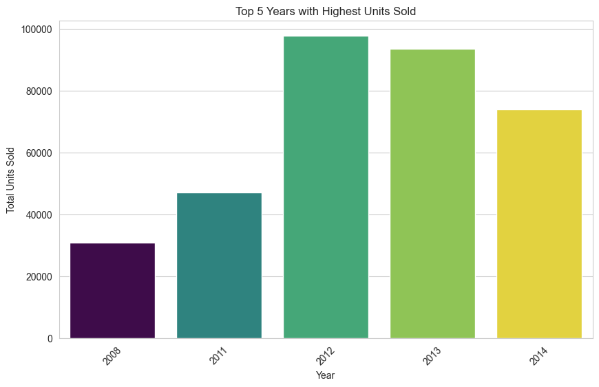

# Car_selling_price_prediction_BiLSM-attention
This project use numerical features to predic car selling price. The dataset contain :
year               
make            
model           
trim            
body           
transmission    
vin                
state              
condition       
odometer           
color           
interior         
seller           
mmr               
sellingprice    
saledate


# EDA
```python
# Check null data
df_car.isnull().sum()

# Check duplicated
df_car.duplicated().sum()

# Describe
df_car.describe()
```

The dataset contain null data. Null data handling with median.
```python
# Convert saledate into datetime format
df_car['saledate'] = pd.to_datetime(df_car['saledate'], errors='coerce', utc=True)
# Fill null data
df_car.fillna(df_car.median(numeric_only=True), inplace=True)
df_car['make'].fillna(df_car['make'].mode()[0], inplace=True)
df_car['model'].fillna(df_car['model'].mode()[0], inplace=True)
df_car['trim'].fillna(df_car['trim'].mode()[0], inplace=True)
df_car['transmission'].fillna(df_car['transmission'].mode()[0], inplace=True)
df_car['body'].fillna(df_car['body'].mode()[0], inplace=True)
df_car['vin'].fillna(df_car['vin'].mode()[0], inplace=True)
df_car['color'].fillna(df_car['color'].mode()[0], inplace=True)
df_car['interior'].fillna(df_car['interior'].mode()[0], inplace=True)
df_car['saledate'].fillna(df_car['saledate'].mode()[0], inplace=True)
```

```python
Extract month and day
df_car['month'] = df_car['saledate'].dt.month
df_car['day'] = df_car['saledate'].dt.day
```

```python
# Handling outlier
def outliers_handling(df, col, p1=0.25, p2=0.75):
    q1 = df[col].quantile(p1)
    q3 = df[col].quantile(p2)
    iqr = q3 - q1
    min_limit = q1 - 1.5 * iqr
    max_limit = q3 + 1.5 * iqr
    return df[(df[col] >= min_limit) & (df[col] <= max_limit)]

# Filter outliers for each column
for col in ['odometer', 'mmr', 'sellingprice']:
    df_car = outliers_handling(df_car, col)
```

# Plot





# Preprocessing Data
data split into Train, Test, and Validation with ratio 8:1:1

```python
X = df_car[['condition', 'odometer', 'mmr', 'year', 'month','day']] # use only numerical feature
y = df_car["sellingprice"]
X_train, X_temp, y_train, y_temp = train_test_split(X, y, test_size=0.2, random_state=42)
X_val, X_test, y_val, y_test = train_test_split(X_temp, y_temp, test_size=0.5, random_state=42)
```
Shape to input into BiLSTM attention
Training sequences shape: (422412, 6), Target shape: (422412,)
Testing sequences shape: (52802, 6), Target shape: (52802,)
Validation sequences shape: (52801, 6), Target shape: (52801, 6)

```python
# Define Model
def model_BiLSTM(input_shape):
    inputs = Input(shape=input_shape)
    
    # First BiLSTM Layer
    x = Bidirectional(LSTM(units=89,return_sequences=True))(inputs)
    x = Dropout(0.4)(x)
    
    # Second BiLSTM Layer
    x = Bidirectional(LSTM(units=16, return_sequences=True))(x)
    
    # Third BiLSTM Layer
    x = Bidirectional(LSTM(units=8, return_sequences=True))(x)
    
    # Attention Layer
    attention_output = Attention()([x, x])
    x = Concatenate()([x, attention_output])
    
    outputs = LSTM(units=1, activation='relu')(x)
    
    model = Model(inputs=inputs, outputs=outputs)
    optimizer = Adam(learning_rate=0.0024020960831476713)
    model.compile(loss=tf.keras.losses.Huber(delta=1.0), optimizer=optimizer, metrics=['mse'])
    
    return model

# Train Data
input_shape = (X_train.shape[1], X_train.shape[2])
model = model_BiLSTM(input_shape)

callback = [tf.keras.callbacks.EarlyStopping(monitor='val_loss', patience=5, restore_best_weights=True)]
history = model.fit(X_train, y_train, epochs=1000, validation_data=(X_test, y_test), batch_size=16, callbacks=callback)

model.summary()
```

Train loss and Val loss

# Predict the selling price
```python
predictions = model.predict(X_test)
```

# Evaluate model
R²: 0.9673

RMSE: 1363.7027

MAPE: 13.2282%

Correlation Coefficient (CC): 0.9835

# Results
Show only first 100 prediction


# Conclusion
R² value indicates that the model explains approximately 96.73% of the variance in the selling price, suggesting excellent predictive accuracy. Root Mean Square Error is relatively low compared to the range of selling prices, indicating that the model's predictions are close to the actual values. With a Mean Absolute Percentage Error around 13%, the model's average error rate is acceptable but could be improved for more precise predictions. The high correlation coefficient demonstrates a strong linear relationship between predicted and actual selling prices, confirming the model's reliability. BiLSTM model with attention performs very well for predicting selling prices, capturing essential patterns in the dataset. The attention mechanism likely enhances the model’s ability to focus on relevant features, leading to higher accuracy in price predictions.


